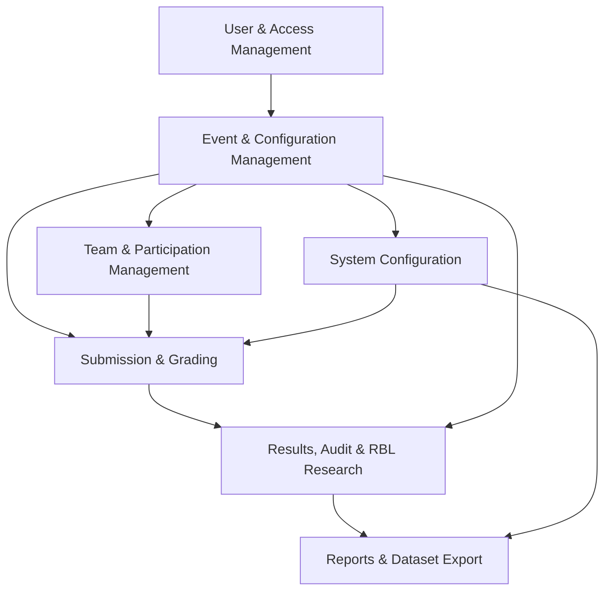
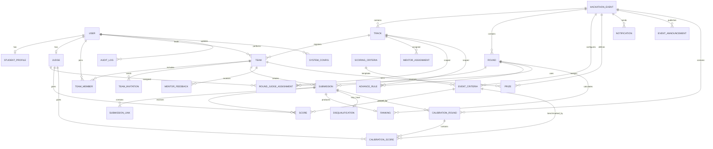
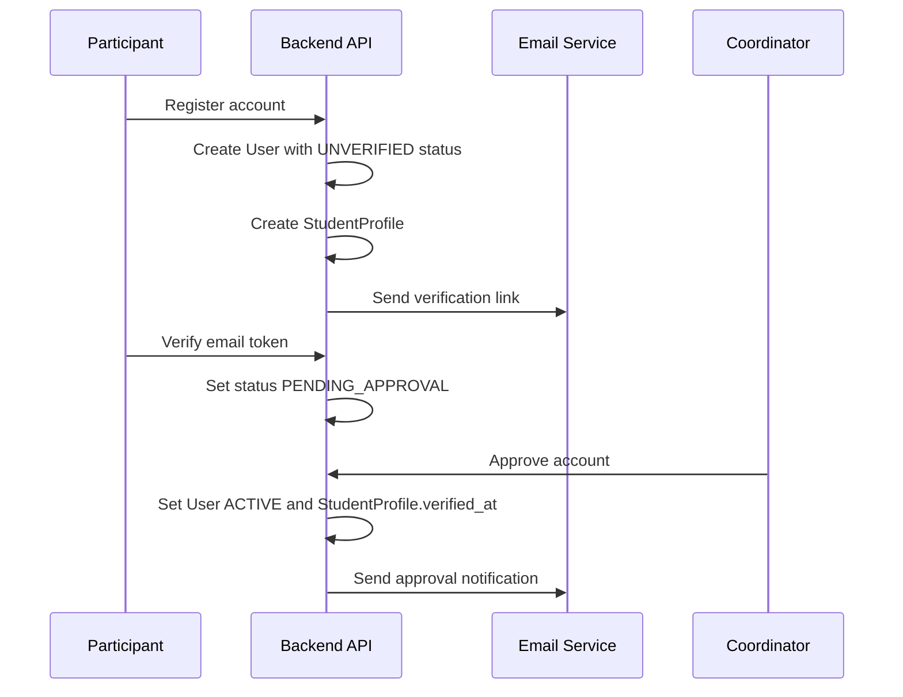
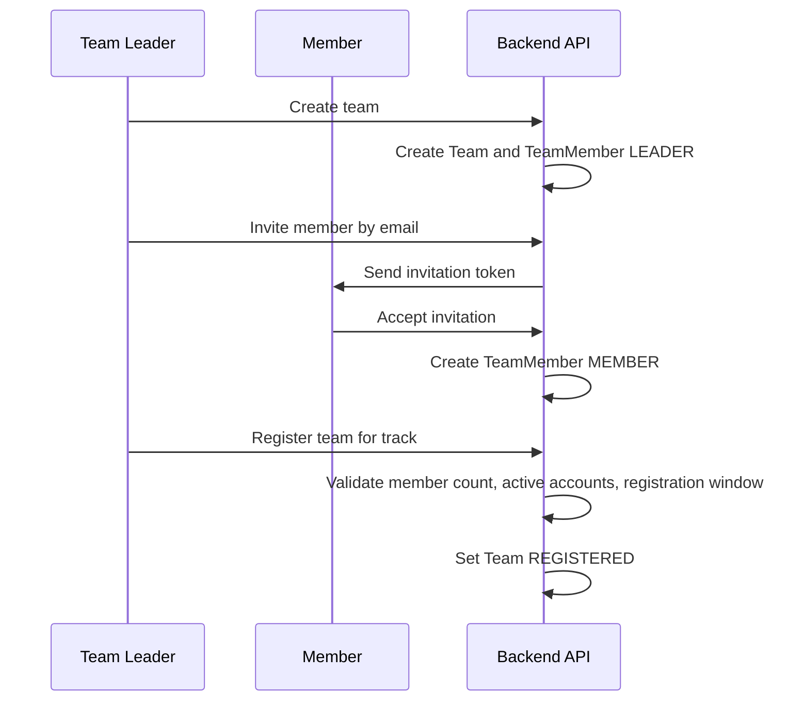
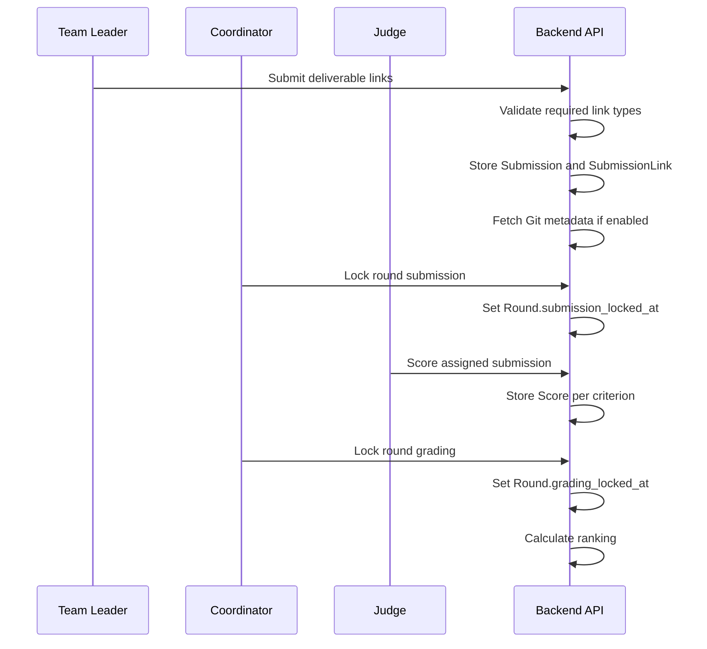
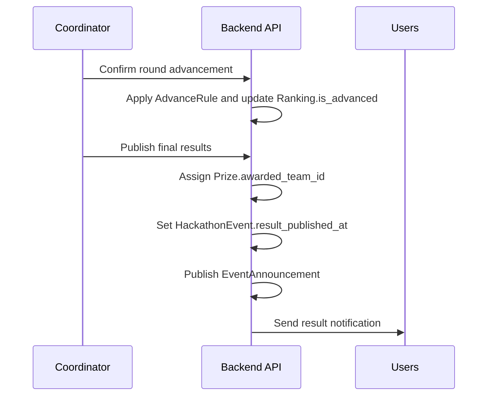

# SEAL – Software Engineering Hackathon Management System

SEAL is a full-stack web platform for managing academic software engineering hackathons at FPT University HCM. The system supports event setup, account approval, team formation, track registration, round-based submissions, judge assignment, blind scoring, ranking, prize publication, audit logging, and research data export for inter-rater reliability analysis.

> Design baseline: Entity Design v6.0  
> Use case baseline: standalone 42-use-case table  
> Stack: React + JavaScript, Spring Boot + Java, PostgreSQL

---

## Table of Contents

- [Overview](#overview)
- [Problem Statement](#problem-statement)
- [Core Capabilities](#core-capabilities)
- [Actors](#actors)
- [Tech Stack](#tech-stack)
- [System Modules](#system-modules)
- [Use Case Coverage](#use-case-coverage)
- [Domain Model](#domain-model)
- [Key Workflows](#key-workflows)
- [RBL Research Support](#rbl-research-support)
- [Project Structure](#project-structure)
- [Getting Started](#getting-started)
- [Environment Variables](#environment-variables)
- [Backend Setup](#backend-setup)
- [Frontend Setup](#frontend-setup)
- [Database Notes](#database-notes)
- [API Overview](#api-overview)
- [Security Model](#security-model)
- [Development Workflow](#development-workflow)
- [Implementation Roadmap](#implementation-roadmap)

---

## Overview

Software Engineering Agile League (SEAL) is an annual academic hackathon organized by the Software Engineering Department and PDP at FPT University HCM. Each year can include Spring, Summer, and Fall hackathon events. Each event can contain multiple competition rounds such as Preliminary and Final rounds.

The system is designed to replace manual spreadsheet-based operations with a centralized platform that manages the full competition lifecycle:

1. Participants register and verify accounts.
2. Coordinators approve student accounts.
3. Teams are formed with 3–5 members.
4. Teams register for competition tracks.
5. Coordinators configure rounds, criteria, mentors, judges, prizes, and calibration rounds.
6. Teams submit deliverables per round.
7. Judges score submissions using blind grading.
8. Coordinators lock submissions, lock grading, confirm advancement, and publish results.
9. The system exports reports and anonymized scoring datasets for research.

---

## Problem Statement

The current SEAL management process is mostly manual and creates several risks:

- Team registration and track management are slow and error-prone.
- Judges score in separate Excel files, forcing manual collection and re-entry.
- Ranking calculation is delayed and can be inconsistent.
- Communication between coordinators, mentors, judges, and teams is fragmented.
- Scoring decisions and disqualifications lack a reliable audit trail.
- Research data for judge scoring consistency is difficult to collect cleanly.

SEAL solves these issues by centralizing event operations, scoring data, communication, audit logs, and report exports.

---

## Core Capabilities

### User & Access Management

- Email/password registration.
- Email verification before approval.
- JWT-based login.
- Logout with client-side token removal and optional server-side token blacklist.
- Password reset by time-limited email token.
- User role management by System Admin.
- Participant approval by Event Coordinator.
- Temporary guest judge accounts.
- Personal profile management.
- Failed-login lockout support.

### Event & Configuration Management

- Create and manage hackathon events by season and year.
- Configure event registration windows.
- Create competition tracks.
- Configure rounds with submission and judging deadlines.
- Define advancement rules such as top-N, minimum score, percentage, and wildcard.
- Manage scoring criteria templates and per-event overrides.
- Assign mentors to tracks.
- Assign judges to rounds and tracks.
- Manage prizes before result publication.
- Configure calibration rounds.
- Manage global runtime configuration through `SystemConfig`.

### Team & Participation Management

- Create teams with 3–5 members.
- Invite members by email token.
- Accept or reject team invitations.
- Join by join code when enabled.
- Edit team profile and project title.
- Remove members before registration closes.
- Leave a team.
- Transfer leadership to another active member.
- Register finalized teams for a track.
- Mentor view of assigned track teams.
- Team member view of own roster and submission progress.

### Submission & Grading

- Submit or update deliverable links for each round.
- Store repository, demo, slide, report, video, and other links.
- Optional GitHub/GitLab repository metadata extraction.
- Lock submission window before judging starts.
- Create calibration round with benchmark scores.
- Judges participate in calibration scoring.
- Judges score assigned submissions using blind grading.
- Store raw scores per judge, submission, and criterion.
- Lock grading window before ranking calculation.
- Mentor feedback for assigned track teams.

### Results, Audit & Reports

- Calculate rankings per round and track.
- Confirm advancement to the next round.
- View ranking and result pages.
- View own team’s aggregate scores after publication.
- Publish official results and award configured prizes.
- Disqualify teams or submissions with mandatory reason.
- Recalculate rankings after disqualification.
- Append-only audit log for sensitive actions.
- Score variance dashboard for judge consistency monitoring.
- Export anonymized RBL dataset.
- Export ranking, scoring, team list, and annual reports.

---

## Actors

| Actor | Description |
|---|---|
| Participant | Student who registers, joins or creates a team, and competes. |
| Team Member | Participant who belongs to a team. |
| Team Leader | Team member with permission to manage team profile, invite members, register track, and submit deliverables. |
| Mentor | Faculty or assigned advisor who supports teams in a track and provides feedback. |
| Internal Judge | SE Faculty judge assigned to score submissions. |
| Guest Judge | External judge with temporary limited-access account. |
| Event Coordinator | SE Department or PDP staff member who manages events, rounds, judges, tracks, submissions, results, and announcements. |
| System Admin | Highest-level administrator who manages users, permissions, and system configuration. |

---

## Tech Stack

### Frontend

- React
- JavaScript
- React Router
- Axios or Fetch API
- HTML/CSS
- Vite

### Backend

- Java
- Spring Boot
- Spring Web
- Spring Security
- Spring Data JPA
- Hibernate
- Bean Validation
- JWT authentication
- Java Mail / SMTP integration

### Database

- PostgreSQL
- UUID primary keys
- JSONB for flexible metadata and report parameters
- Partial unique indexes where required

### Optional Integrations

- GitHub API for repository metadata
- GitLab API for repository metadata
- SMTP provider for verification, reset, invitation, reminder, and announcement emails
- Object storage or local storage for exported CSV/XLSX/PDF files

---

## System Modules



---

## Use Case Coverage

The standalone use case table is treated as the canonical use case numbering for this repository.

| Module | Use Cases | Scope |
|---|---:|---|
| User & Access Management | UC-01 → UC-10 | Register, verify email, login, logout, reset password, manage users, approve accounts, guest judge account, system management, profile management. |
| Event & Configuration Management | UC-11 → UC-18 | Event setup, rounds, tracks, mentors, criteria, judge assignment, notifications, prizes, calibration setup. |
| Team & Participation Management | UC-19 → UC-26 | Team creation, invitations, team profile, track registration, progress view, leadership transfer, leaving team. |
| Submission & Grading | UC-27 → UC-33 | Deliverable submission, calibration participation, blind scoring, lock submission, lock grading, mentor feedback, assigned grading list. |
| Results, Audit & RBL Research | UC-34 → UC-42 | Advancement, ranking, team scores, publish results, disqualification, audit log, variance dashboard, RBL export, reports. |

---

## Domain Model

Entity Design v6.0 contains 28 main entities and 53 foreign-key relationships.

### Entity Groups

| Group | Entities |
|---|---|
| User & Access | `User`, `StudentProfile`, `Judge`, `TeamInvitation` |
| Event & Configuration | `HackathonEvent`, `Track`, `Round`, `AdvanceRule`, `SystemConfig` |
| Team & Participation | `Team`, `TeamMember`, `MentorAssignment`, `MentorFeedback` |
| Submission & Grading | `ScoringCriteria`, `EventCriteria`, `RoundJudgeAssignment`, `Submission`, `SubmissionLink`, `Score`, `Ranking`, `Disqualification` |
| Results, Audit & Research | `CalibrationRound`, `CalibrationScore`, `Prize`, `AuditLog`, `Notification`, `EventAnnouncement`, `ExportJob` |

### Main Entity Relationships



---

## Key Workflows

### Account Registration and Approval



### Team Registration



### Submission and Grading



### Result Publication



---

## RBL Research Support

The project also supports RBL research on scoring consistency in academic software engineering hackathons.

### Main Research Question

> How consistent are hackathon evaluation scores across different judges evaluating the same submission in academic software engineering competitions?

### Sub-Questions

| ID | Question | Data Support |
|---|---|---|
| RQ1 | What is the overall inter-rater reliability of SEAL hackathon scoring? | Raw `Score` rows, `CalibrationScore`, anonymized RBL export. |
| RQ2 | Which scoring criteria show the highest and lowest agreement? | `ScoringCriteria.is_technical`, `EventCriteria.is_technical_override`, score variance dashboard. |
| RQ3 | Does judge type affect scoring consistency? | `Judge.judge_type` as `INTERNAL` or `GUEST`. |

### RBL Features

- Store every judge score separately per submission and criterion.
- Preserve raw scoring data for reliability analysis.
- Calibration round with benchmark scores.
- Score variance dashboard by judge, criterion, criterion type, and judge type.
- Export anonymized CSV datasets with hashed judge IDs.
- Export report data for ICC and Krippendorff's alpha analysis.

---

## Project Structure

Recommended repository layout:

```text
SWP391-SEAL-Software-Engineering-Hackathon-Management-System/
├── backend/
│   └── SEAL Hackathon/
│       ├── src/
│       │   ├── main/
│       │   │   ├── java/com/t7/seal/
│       │   │   │   ├── config/
│       │   │   │   ├── controllers/
│       │   │   │   ├── dto/
│       │   │   │   ├── entities/
│       │   │   │   ├── enums/
│       │   │   │   ├── exceptions/
│       │   │   │   ├── repositories/
│       │   │   │   ├── security/
│       │   │   │   ├── services/
│       │   │   │   └── validators/
│       │   │   └── resources/
│       │   │       ├── application.yml
│       │   │       └── application-dev.yml
│       │   └── test/
│       ├── pom.xml
│       └── .env.example
├── frontend/
│   ├── src/
│   │   ├── api/
│   │   ├── assets/
│   │   ├── components/
│   │   ├── hooks/
│   │   ├── layouts/
│   │   ├── pages/
│   │   ├── routes/
│   │   ├── services/
│   │   └── utils/
│   ├── package.json
│   └── .env.example
├── docs/
│   ├── CONTEXT.docx
│   ├── SEAL_Entity_Design_v6.docx
│   └── usecase.docx
└── README.md
```

---

## Getting Started

### Prerequisites

Install these tools before running the project:

- Java 17 or later
- Maven 3.9 or Maven Wrapper
- Node.js 20 or later
- npm
- PostgreSQL 15 or later
- Git

### Clone Repository

```bash
git clone https://github.com/Miniks040506/SWP391-SEAL-Software-Engineering-Hackathon-Management-System.git
cd SWP391-SEAL-Software-Engineering-Hackathon-Management-System
```

---

## Environment Variables

Create `.env` files from `.env.example`. Do not commit real credentials.

### Backend `.env.example`

```env
DB_URL=jdbc:postgresql://localhost:5432/seal_hackathon
DB_USERNAME=postgres
DB_PASSWORD=postgres

JWT_SECRET=change-this-to-a-real-secret-at-least-32-characters
JWT_EXPIRATION_MS=86400000

MAIL_HOST=smtp.gmail.com
MAIL_PORT=587
MAIL_USERNAME=your-email@gmail.com
MAIL_PASSWORD=your-app-password
MAIL_FROM=your-email@gmail.com

FRONTEND_URL=http://localhost:5173

GITHUB_TOKEN=
GITLAB_TOKEN=

SYSTEM_CONFIG_MASTER_KEY=change-this-32-byte-master-key
```

### Frontend `.env.example`

```env
VITE_API_BASE_URL=http://localhost:8080/api
VITE_APP_NAME=SEAL Hackathon
```

---

## Backend Setup

### 1. Create Database

```bash
createdb seal_hackathon
```

Or create it manually in PostgreSQL:

```sql
CREATE DATABASE seal_hackathon;
```

### 2. Configure Backend

```bash
cd "backend/SEAL Hackathon"
cp .env.example .env
```

Update `.env` with your local PostgreSQL username and password.

### 3. Run Backend

On Windows:

```bash
mvnw.cmd spring-boot:run
```

On Linux/macOS:

```bash
./mvnw spring-boot:run
```

If Maven Wrapper is not available:

```bash
mvn spring-boot:run
```

Backend default URL:

```text
http://localhost:8080
```

---

## Frontend Setup

```bash
cd frontend
npm install
npm run dev
```

Frontend default URL:

```text
http://localhost:5173
```

---

## Database Notes

Recommended database conventions:

- Use UUID primary keys for all main entities.
- Use `TIMESTAMP` fields for lifecycle events such as `submitted_at`, `submission_locked_at`, `grading_locked_at`, and `result_published_at`.
- Use JSONB for flexible fields such as repository metadata, score breakdown, benchmark scores, export parameters, and audit states.
- Use append-only behavior for `AuditLog`.
- Use partial unique indexes for active-only constraints, such as active team membership and pending invitations.
- Do not hard delete important competition records after publication.

### Important Constraints

| Entity | Constraint |
|---|---|
| `User` | Unique email. |
| `StudentProfile` | Unique `user_id`. |
| `Judge` | Unique `user_id`. |
| `HackathonEvent` | Unique season and year. |
| `Round` | Unique `event_id + order_index`. |
| `TeamMember` | One active membership per user/team. |
| `Submission` | One submission per team per round. |
| `Score` | One score per submission, judge, and criterion. |
| `Ranking` | One ranking snapshot per submission and round. |
| `Prize` | Unique event, track, and rank position. |
| `SystemConfig` | Unique config key. |

---

## API Overview

The final endpoint names can change during implementation, but the API should follow these module boundaries.

### Auth

| Method | Endpoint | Purpose |
|---|---|---|
| `POST` | `/api/auth/register` | Register participant account. |
| `POST` | `/api/auth/verify-email` | Verify email token. |
| `POST` | `/api/auth/login` | Login and issue JWT. |
| `POST` | `/api/auth/logout` | Logout current user. |
| `POST` | `/api/auth/forgot-password` | Request reset password token. |
| `POST` | `/api/auth/reset-password` | Reset password with token. |

### Users

| Method | Endpoint | Purpose |
|---|---|---|
| `GET` | `/api/users/me` | View current profile. |
| `PUT` | `/api/users/me` | Update profile. |
| `PUT` | `/api/users/me/password` | Change own password. |
| `GET` | `/api/admin/users` | Search users. |
| `PATCH` | `/api/admin/users/{id}/status` | Update user status. |
| `PATCH` | `/api/admin/users/{id}/role` | Update user role. |

### Events, Tracks, and Rounds

| Method | Endpoint | Purpose |
|---|---|---|
| `POST` | `/api/events` | Create event. |
| `GET` | `/api/events` | List events. |
| `GET` | `/api/events/{id}` | View event details. |
| `PUT` | `/api/events/{id}` | Update event. |
| `POST` | `/api/events/{id}/tracks` | Create track. |
| `POST` | `/api/events/{id}/rounds` | Create round. |
| `POST` | `/api/rounds/{id}/lock-submission` | Lock submission window. |
| `POST` | `/api/rounds/{id}/lock-grading` | Lock grading window. |

### Teams

| Method | Endpoint | Purpose |
|---|---|---|
| `POST` | `/api/teams` | Create team. |
| `GET` | `/api/teams/my-team` | View current user's team. |
| `PUT` | `/api/teams/{id}` | Update team profile. |
| `POST` | `/api/teams/{id}/invite` | Invite member. |
| `POST` | `/api/team-invitations/{token}/accept` | Accept invitation. |
| `POST` | `/api/team-invitations/{token}/decline` | Decline invitation. |
| `POST` | `/api/teams/{id}/register` | Register team for track. |
| `POST` | `/api/teams/{id}/transfer-leader` | Transfer leadership. |
| `POST` | `/api/teams/{id}/leave` | Leave team. |

### Submissions and Grading

| Method | Endpoint | Purpose |
|---|---|---|
| `POST` | `/api/submissions` | Submit deliverables. |
| `PUT` | `/api/submissions/{id}` | Update deliverables before lock. |
| `GET` | `/api/judging/assignments` | View assigned grading list. |
| `GET` | `/api/judging/submissions/{id}` | View assigned submission. |
| `POST` | `/api/judging/submissions/{id}/scores` | Save score draft or final score. |
| `POST` | `/api/events/{id}/calibration-rounds` | Create calibration round. |
| `POST` | `/api/calibration-rounds/{id}/scores` | Submit calibration scores. |

### Results and Reports

| Method | Endpoint | Purpose |
|---|---|---|
| `POST` | `/api/rounds/{id}/rankings/calculate` | Calculate rankings. |
| `POST` | `/api/rounds/{id}/advancement/confirm` | Confirm advancement. |
| `GET` | `/api/rankings` | View ranking. |
| `GET` | `/api/teams/{id}/scores` | View own team scores after publication. |
| `POST` | `/api/events/{id}/publish-results` | Publish final results. |
| `POST` | `/api/submissions/{id}/disqualify` | Disqualify submission. |
| `GET` | `/api/audit-logs` | View audit logs. |
| `GET` | `/api/research/variance-dashboard` | View score variance dashboard. |
| `POST` | `/api/exports` | Create export job. |
| `GET` | `/api/exports/{id}` | View export status. |

---

## Security Model

### Authentication

- JWT is issued after successful login.
- Only approved active accounts can log in.
- Passwords are stored as bcrypt hashes.
- Password reset uses time-limited tokens.
- Optional token blacklist can invalidate JWTs before expiration.

### Authorization

Access is role-based:

| Role | Main Permissions |
|---|---|
| `STUDENT` | Register, manage profile, create/join team, submit deliverables, view own scores. |
| `MENTOR` | View assigned track teams and provide feedback. |
| `JUDGE` | View assigned grading list, participate in calibration, score assigned submissions. |
| `COORDINATOR` | Manage events, rounds, tracks, teams, judges, submissions, results, prizes, and reports. |
| `ADMIN` | Manage users, permissions, system configuration, and global reports. |

### Audit Logging

Sensitive operations must create `AuditLog` entries:

- Account approval and suspension.
- Email verification.
- Password reset and password change.
- Role or permission update.
- Submission update.
- Round submission lock.
- Round grading lock and unlock.
- Score create and update.
- Ranking recalculation.
- Advancement confirmation.
- Result publication.
- Disqualification.
- Prize create, update, delete, and award.
- System configuration changes.

---

## System Configuration

`SystemConfig` stores runtime-changeable global settings managed by the System Admin.

Examples:

| Key | Category | Purpose |
|---|---|---|
| `integration.github.api_token` | `INTEGRATION` | GitHub API token for repository metadata extraction. |
| `integration.gitlab.api_token` | `INTEGRATION` | GitLab API token for repository metadata extraction. |
| `smtp.host` | `SMTP` | SMTP host for email notifications. |
| `smtp.port` | `SMTP` | SMTP port. |
| `feature.github_integration.enabled` | `FEATURE_FLAG` | Enable or disable repository metadata extraction. |
| `feature.calibration.mandatory` | `FEATURE_FLAG` | Require judges to finish calibration before real scoring. |
| `feature.token_blacklist.enabled` | `FEATURE_FLAG` | Enable server-side logout invalidation. |
| `rate_limit.export_per_hour` | `RATE_LIMIT` | Limit export job creation. |

Encrypted values must never be returned as plain text in API responses.

---

## Development Workflow

### Branch Naming

```text
feature/<short-feature-name>
fix/<short-bug-name>
refactor/<short-area-name>
docs/<short-doc-name>
```

Examples:

```text
feature/auth-flow
feature/create-entities
feature/submission-grading
fix/login-lockout
fix/team-invitation-token
docs/update-readme
```

### Commit Message Style

Use short imperative messages:

```text
add user entity
implement jwt login
add round grading lock
fix team invitation validation
update readme
```

### Pull Request Checklist

Before opening a pull request:

- Code compiles.
- Tests pass if available.
- No real secrets committed.
- `.env` is not committed.
- New entity changes are reflected in migrations or schema generation.
- API changes are documented.
- Validation and authorization are implemented.
- Sensitive operations write audit logs.

---

## Implementation Roadmap

| Sprint | Backend 1: Auth, Event, Team | Backend 2: Scoring, RBL, Export |
|---:|---|---|
| 1 | Auth flow, email verification, reset password, logout, profile management. | Event CRUD, round fields, `SystemConfig`, config encryption utility. |
| 2 | Team lifecycle, register team, leave team, transfer leader. | Advance rules, mentor assignment, scoring criteria, event criteria, prize CRUD. |
| 3 | Team invitations, mentor feedback. | Judge assignment, scoring progress, calibration round setup. |
| 4 | Submission, submission update, lock submission. | Calibration scoring, blind scoring, lock grading. |
| 5 | Notifications, announcements, track/team progress view. | Ranking service, advancement service, leaderboard, team score view. |
| 6 | Publish results, award prizes, audit log query. | Disqualification cascade, variance dashboard, RBL export, final reports. |

---

## Status

This repository is under active development for the SEAL academic hackathon management system.

Current design target:

- 42 use cases.
- 28 main entities.
- 53 foreign-key relationships.
- Full hackathon management workflow.
- RBL-ready scoring data model.
- Audit-ready competition operations.
