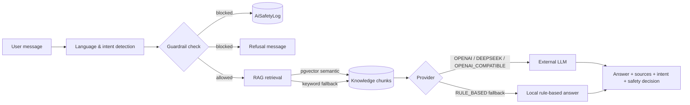
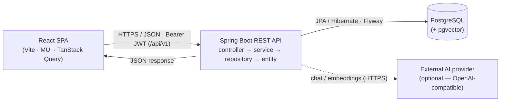
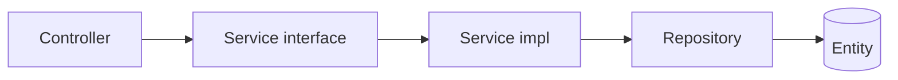
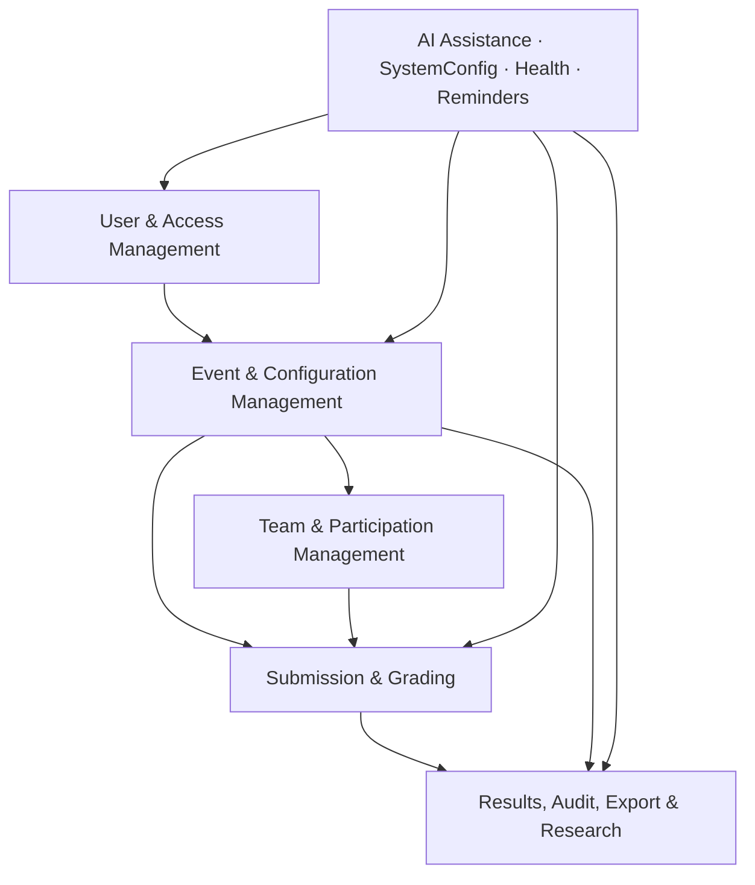
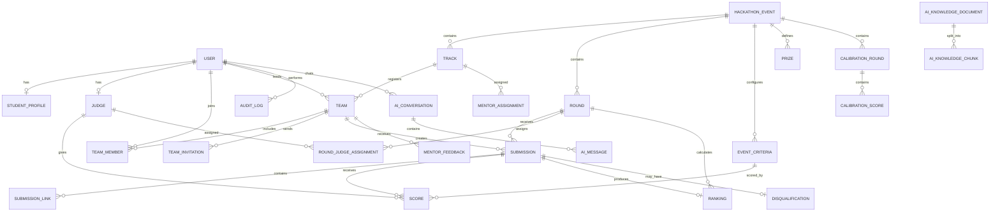

<div align="center">

# 🏆 SEAL — Software Engineering Hackathon Management System

**A full-stack platform for running academic software-engineering hackathons end to end — from account approval and team formation to blind judging, ranking, prize publication, research-grade scoring exports, and an AI assistant with RAG and academic-integrity guardrails.**

Built for the Software Engineering Department & PDP at **FPT University HCM**.

[](https://openjdk.org/projects/jdk/21/)
[](https://spring.io/projects/spring-boot)
[](https://react.dev/)
[](https://www.typescriptlang.org/)
[](https://www.postgresql.org/)
[](#-project-status)

</div>

---

## 📑 Table of Contents

- [About the Project](#-about-the-project)
- [Project Status](#-project-status)
- [Features](#-features)
- [AI Assistant](#-ai-assistant)
- [Tech Stack](#-tech-stack)
- [Architecture](#-architecture)
- [Background Jobs](#-background-jobs)
- [Domain Model](#-domain-model)
- [Repository Structure](#-repository-structure)
- [Getting Started](#-getting-started)
- [Configuration](#-configuration)
- [API Documentation](#-api-documentation)
- [Security Model](#-security-model)
- [Research (Inter-Rater Reliability)](#-research-inter-rater-reliability)
- [Delivery Timeline](#-delivery-timeline)
- [Contributing](#-contributing)
- [Team](#-team)
- [License](#-license)

---

## 📖 About the Project

**SEAL** (Software Engineering Agile League) is an annual academic hackathon organized by the Software Engineering Department and PDP at FPT University HCM. Each academic year can host up to three events — **Spring**, **Summer**, and **Fall** — and each event can contain multiple competition rounds (e.g. *Preliminary* and *Final*).

This platform replaces the manual, spreadsheet-driven process with a single system that manages the **full competition lifecycle**:

> Account approval → Team formation → Track registration → Round configuration → Submission → Blind judging → Calibration → Ranking → Advancement → Prize publication → Audit & research export

Beyond operations, SEAL doubles as a **research data platform**: every individual `judge × criterion × submission` score is preserved so the organizing committee can study **inter-rater reliability** (ICC, Krippendorff's α) of hackathon scoring. The platform also ships a **bilingual AI assistant** (Vietnamese/English) with retrieval-augmented generation over project knowledge and guardrails that block academic-integrity violations.

### Why it exists

The legacy process suffered from recurring pain points that SEAL eliminates:

- Team and track management handled by hand — slow and error-prone.
- Judges scoring in separate Excel files, requiring manual collection and re-entry.
- Delayed, inconsistent ranking calculation.
- Fragmented communication between coordinators, mentors, judges, and teams.
- No reliable audit trail for scoring decisions and disqualifications.
- Scoring-consistency research data that is hard to collect cleanly.

---

## 🚦 Project Status

> **Development completed.** All six functional modules — including the extended Module VI (AI assistant, system configuration, health monitoring, and reminders) — are implemented across the backend and the role-based frontend, covering the **24 use cases** specified in the project SRS.

| Area | State |
|---|---|
| Domain model | ✅ 38 JPA entities + 39 enums + 38 repositories |
| Service layer | ✅ 49 service interfaces + 58 implementations |
| REST surface | ✅ 33 controllers with request/response DTO records (75 request / 113 response) |
| Authentication | ✅ JWT (access + refresh), email verification, password reset, password history, token blacklist, OAuth2 social login |
| AI assistant | ✅ Floating chatbox, RAG (pgvector semantic + keyword fallback), bilingual replies, guardrails, safety logs, admin knowledge management |
| Integrations | ✅ Cloudinary (images), AWS S3 (submission files), GitHub/GitLab metadata, async SMTP email outbox, OpenAI-compatible AI providers |
| Notifications & reminders | ✅ Notification inbox, event announcements, manual + auto-generated deadline reminders over notification/email channels |
| Frontend | ✅ Feature-based React SPA (24 feature modules) with dedicated experiences for Admin, Coordinator, Judge, Mentor, and Participant roles |
| Database schema | ✅ Flyway-managed (16 versioned migrations, `ddl-auto: validate`) |
| Background jobs | ✅ 6 scheduled reconciliation jobs (notifications, deadlines, guest judges, incomplete teams, account anonymization) |

---

## ✨ Features

Features are organized into six functional modules (matching the SRS).

### 1. User & Access Management
- Email/password registration with email verification before approval.
- JWT-based authentication (access + refresh tokens) plus **OAuth2 social login** (Google/GitHub), with optional server-side token blacklist on logout.
- Time-limited password reset via email code, with password-history reuse prevention.
- Account approval workflow (Coordinator) and role management (Admin).
- Temporary guest-judge accounts with automatic deactivation on expiry.
- Failed-login lockout, personal profile and avatar management.

### 2. Event & Configuration Management
- Create and manage events by **season + year**, with publish/lifecycle state control.
- Configure registration windows, competition **tracks**, and **rounds** (with submission/judging deadlines and automatic deadline transitions).
- Define advancement rules (top-N, minimum score, percentage, wildcard).
- Manage scoring-criteria templates with per-event overrides.
- Assign mentors to tracks and judges (internal or guest) to rounds/tracks.
- Manage prizes and calibration rounds.
- Runtime configuration through `SystemConfig` with masked secrets and feature flags.

### 3. Team & Participation Management
- Create teams of **3–5 members**.
- Invite members by email token or join code; accept / decline invitations and join requests.
- Edit team profile, transfer leadership, remove members, leave a team.
- Register finalized teams for a track, with coordinator review/approval.
- Mentor view of assigned teams; member view of roster and progress.

### 4. Submission & Grading
- Submit / update deliverable links per round (repo, demo, slides, report, video, …) with required-link validation.
- Optional GitHub/GitLab repository metadata extraction.
- **Lock submission** window before judging begins (manual or deadline-driven).
- **Blind scoring** — raw score stored per `judge × submission × criterion`, with draft/final distinction.
- Calibration rounds with benchmark scores and distribution charts.
- **Lock grading** window before ranking calculation.
- Mentor feedback for assigned teams.

### 5. Results, Audit, Export & Research
- Per-round, per-track ranking calculation with tie handling, advancement confirmation.
- Publish official results, public standings, and award configured prizes.
- Disqualify teams/submissions (mandatory reason), handle appeal/overturn, and recalculate rankings.
- Append-only **audit log** for all sensitive operations, with admin filtering.
- Async **export jobs** (CSV/XLSX) with `QUEUED / PROCESSING / DONE / FAILED` states.
- Score-variance dashboard for judge-consistency monitoring.
- Anonymized research dataset export (hashed judge IDs, team names stripped).

### 6. AI Assistance, System Configuration, Health & Reminders
- **AI chatbox** available to every authenticated user in the logged-in layout (see [AI Assistant](#-ai-assistant)).
- Admin **AI knowledge management** — seed defaults, create documents with role/module/use-case metadata, automatic chunking, embedding reindex.
- Admin **AI safety logs** — review every guardrail BLOCK/ALLOW decision with risk type and reason.
- **Advanced event reminders** — coordinators generate submission/judging deadline reminders (days-before-deadline) or create manual reminders targeted at participants, judges, mentors, or teams, delivered via notification and/or email.
- Admin system health page and centralized `SystemConfig` (feature flags, RAG/guardrail switches, reminder defaults, assistant disclaimer).

---

## 🤖 AI Assistant

SEAL includes a built-in AI assistant, surfaced as a floating chat widget for all authenticated users.



| Capability | Detail |
|---|---|
| **Bilingual** | Detects Vietnamese/English, answers in the user's language, and supports translation requests. |
| **RAG** | Retrieves project knowledge before answering — semantic search over **pgvector** embeddings when available, transparent keyword fallback otherwise. Sources are shown as cards in the UI. |
| **Guardrails** | Blocks complete assignment/team-submission code requests, plagiarism bypass, prompt injection, and private-data requests. Optional project-scope restriction refuses out-of-scope questions. |
| **Safety logging** | Every guardrail decision (BLOCK/ALLOW) is persisted to `AiSafetyLog` for admin review. |
| **Provider abstraction** | `RULE_BASED` local fallback works with **zero external credentials**; `OPENAI`, `DEEPSEEK`, or any `OPENAI_COMPATIBLE` endpoint can be enabled via `seal.ai.*` properties. Provider failures degrade to a safe fallback answer. |
| **Conversations** | Conversations and messages are persisted per user (`AiConversation`, `AiMessage`) and reloadable from the widget. |

> ⚠️ By design, the assistant **explains system usage, translates, and guides debugging — it will not write hackathon solution code for participants**.

### AI endpoints

| Endpoint | Who | Purpose |
|---|---|---|
| `GET /assistant/context` | Authenticated | Feature flags, suggested prompts, disclaimer |
| `POST /assistant/chat` | Authenticated | Send a message; returns answer, sources, intent, safety decision |
| `GET /assistant/conversations` | Authenticated | List own conversations |
| `GET /assistant/conversations/{id}/messages` | Authenticated | Load conversation history |
| `GET/POST /admin/assistant/knowledge` | Admin | List / create knowledge documents |
| `POST /admin/assistant/knowledge/seed` | Admin | Seed default project knowledge |
| `POST /admin/assistant/knowledge/reindex` | Admin | Rebuild chunk embeddings |
| `GET /admin/assistant/safety-logs` | Admin | Filter guardrail decisions |

---

## 🛠 Tech Stack

### Backend
| Category | Technology |
|---|---|
| Language | Java 21 |
| Framework | Spring Boot 4.0.6 (Web MVC, Security, Data JPA, Mail, Actuator, OAuth2, Scheduling) |
| Persistence | Hibernate ORM, PostgreSQL driver |
| Migrations | Flyway (16 versioned migrations, `ddl-auto: validate`) |
| Auth | JWT via `jjwt` 0.13, BCrypt password hashing, OAuth2 social login |
| Validation | Jakarta Bean Validation |
| File storage | Cloudinary (images/banners), AWS S3 (submission files) |
| AI | OpenAI-compatible chat & embedding providers, pgvector semantic search, rule-based fallback |
| Integrations | GitHub / GitLab repository metadata, SMTP email outbox + scheduler |
| API docs | SpringDoc OpenAPI (Swagger UI) |
| Build | Maven (with wrapper), Lombok |

### Frontend
| Category | Technology |
|---|---|
| Language | TypeScript |
| Framework | React 19 + Vite 8 |
| UI | MUI 9 (+ Icons), Tailwind CSS 4 |
| Data fetching | TanStack Query 5, Axios |
| State | Zustand 5 |
| Routing | React Router DOM 7 |
| Forms & validation | React Hook Form 7 + Zod 4 |
| Charts | Recharts 3 |
| Notifications / dates | notistack, date-fns |
| Tooling | ESLint, Prettier |

### Database
- PostgreSQL 15+ (with optional **pgvector** extension for semantic AI retrieval)
- UUID primary keys across all main tables
- JSONB for flexible payloads (repo metadata, score breakdowns, export params, audit states)
- Partial unique indexes for active-only constraints

---

## 🏗 Architecture

The system is a **decoupled SPA + REST API**:



### Backend layering

Strict, one-directional flow — controllers never touch repositories directly:



- **Controllers** are thin REST adapters returning `ResponseEntity<T>`; all routes live under `/api/v1` via `ApiPaths.API_V1`.
- **Services** own business logic, transaction boundaries, input normalization, and audit logging.
- **Repositories** extend `JpaRepository<Entity, UUID>`.
- **DTOs** are Java `record`s under `request/<module>` and `response/<module>` — entities are never exposed directly.

### Module map



---

## ⏰ Background Jobs

Spring scheduling runs six idempotent reconciliation jobs, each with a configurable fixed delay:

| Scheduler | Purpose | Default delay |
|---|---|---|
| `NotificationDispatchScheduler` | Dispatch queued/scheduled notifications and email outbox work | 60 s |
| `RoundDeadlineReminderScheduler` | Reconcile submission/judging deadline reminders | 300 s |
| `RoundDeadlineTransitionScheduler` | Move due rounds into pending-lock/closed workflow | 60 s |
| `GuestJudgeDeactivationScheduler` | Deactivate expired temporary guest judges | 1 h |
| `TeamIncompleteRegistrationScheduler` | Mark non-admitted teams incomplete when required | 1 h |
| `UnverifiedAccountAnonymizationScheduler` | Anonymize stale `UNVERIFIED` accounts after retention | 1 h |

---

## 🗃 Domain Model

The schema comprises **38 JPA entities** grouped by module:

| Group | Entities |
|---|---|
| User & Access | `User`, `StudentProfile`, `Judge`, `PasswordHistory`, `TeamInvitation` |
| Event & Configuration | `HackathonEvent`, `Track`, `Round`, `AdvanceRule`, `SystemConfig` |
| Team & Participation | `Team`, `TeamMember`, `MentorAssignment`, `MentorFeedback` |
| Submission & Grading | `ScoringCriteria`, `EventCriteria`, `RoundJudgeAssignment`, `Submission`, `SubmissionLink`, `Score`, `Ranking`, `Disqualification` |
| Results & Research | `CalibrationRound`, `CalibrationScore`, `Prize`, `AuditLog`, `ExportJob` |
| Notifications & Email | `Notification`, `NotificationRecipient`, `NotificationTemplate`, `EventAnnouncement`, `EmailOutbox`, `EmailDeliveryLog` |
| AI Assistant | `AiConversation`, `AiMessage`, `AiKnowledgeDocument`, `AiKnowledgeChunk`, `AiSafetyLog` (+ `ai_knowledge_chunk_embeddings` pgvector table) |

### Core relationships



### Key constraints

| Entity | Unique constraint |
|---|---|
| `User` | `email` |
| `StudentProfile` / `Judge` | `user_id` |
| `HackathonEvent` | `(season, year)` |
| `Round` | `(event_id, order_index)` |
| `TeamMember` | one active membership per `(user_id, team_id)` |
| `Submission` | one per `(team_id, round_id)` |
| `Score` | one per `(submission_id, judge_id, event_criteria_id)` |
| `Ranking` | one snapshot per `(submission_id, round_id)` |
| `Prize` | `(event_id, track_id, rank_position)` |
| `SystemConfig` | `config_key` |

> `Submission`, `Score`, `Ranking`, `Disqualification`, and `AuditLog` are **never hard-deleted** after publication.

---

## 📂 Repository Structure

```text
SWP391-SEAL-.../
├── backend/
│   └── SEAL Hackathon/                 # Spring Boot service
│       ├── src/main/java/com/t7/seal/
│       │   ├── config/                 # SecurityConfig, ApiPaths, Cloudinary, AI, beans
│       │   ├── controller/             # 33 thin REST controllers
│       │   ├── domain/                 # 39 enums (UserRole, SubmissionStatus, …)
│       │   ├── dto/                    # Auth principal types
│       │   ├── entities/               # 38 JPA entities
│       │   ├── filter/                 # JwtAuthenticationFilter
│       │   ├── infrastructure/         # Converters, security utils
│       │   ├── repository/             # 38 Spring Data JPA repositories
│       │   ├── request/<module>/       # 75 inbound DTO records
│       │   ├── response/<module>/      # 113 outbound DTO records
│       │   ├── security/               # JWT / OAuth2 support
│       │   └── service/                # 49 service interfaces + impl/ (58 implementations)
│       ├── src/main/resources/
│       │   ├── application.yaml         # base config (profile: dev) incl. seal.ai.*
│       │   ├── application-dev.yaml
│       │   ├── application-prod.yaml
│       │   └── db/migration/            # 16 Flyway migrations (V1 … V16)
│       ├── pom.xml
│       └── mvnw / mvnw.cmd
│
├── frontend/
│   └── Seal_Hackathon/                  # React + Vite SPA
│       ├── src/
│       │   ├── api/                     # 27 typed API modules + Axios client (Bearer JWT)
│       │   ├── app/                     # App, router, providers, theme
│       │   ├── components/              # common / layout / guards
│       │   ├── features/                # 24 feature modules by role & domain:
│       │   │   ├── auth/ profile/       #   login, register, verify, reset, OAuth, profile
│       │   │   ├── admin/ auditLog/     #   user management, audit logs, dashboards
│       │   │   ├── assistant/           #   AI chat widget, admin knowledge & safety logs
│       │   │   ├── coordinator/         #   event creation/editing, announcements, teams
│       │   │   ├── reminders/           #   coordinator event reminders
│       │   │   ├── judge/ calibration/  #   grading, calibration, judge dashboard
│       │   │   ├── grading/ grading-progress/
│       │   │   ├── mentor/              #   assigned teams, feedback, submissions
│       │   │   ├── criteria/            #   scoring & event criteria management
│       │   │   ├── events/ ranking/     #   public event pages, leaderboard
│       │   │   ├── results/ advancement/ disqualification/
│       │   │   ├── teams/ submissions/  #   team lifecycle, deliverable submission
│       │   │   ├── exports/ rbl/        #   export jobs, variance dashboard, RBL export
│       │   │   ├── notification/        #   notification inbox & bell
│       │   │   └── system/              #   SystemConfig & health (admin)
│       │   │       (each: pages / components / hooks / schemas)
│       │   ├── hooks/  stores/  types/  utils/
│       │   └── main.tsx
│       ├── .env.example
│       ├── vite.config.ts
│       └── package.json
│
├── postman/                             # API test collections
├── README.md
└── SECURITY.md
```

---

## 🚀 Getting Started

### Prerequisites

| Tool | Version |
|---|---|
| Java (JDK) | 21+ |
| Maven | 3.9+ (or use the bundled wrapper) |
| Node.js | 20+ |
| PostgreSQL | 15+ (pgvector extension optional, for semantic AI retrieval) |
| Git | latest |

### 1. Clone

```bash
git clone https://github.com/Miniks040506/SWP391-SEAL-Software-Engineering-Hackathon-Management-System.git
cd SWP391-SEAL-Software-Engineering-Hackathon-Management-System
```

### 2. Create the database

```bash
createdb seal_hackathon
# or, in psql:  CREATE DATABASE seal_hackathon;
```

> Flyway runs all 16 migrations automatically on first startup, including seed data. The pgvector migration runs `CREATE EXTENSION IF NOT EXISTS vector;` — if your database user cannot create extensions, run it manually as a superuser first (the AI assistant still works without it via keyword retrieval).

### 3. Run the backend

```bash
cd "backend/SEAL Hackathon"

# provide credentials & secrets via environment variables (see Configuration)
# then start the app:

# Windows
mvnw.cmd spring-boot:run

# Linux / macOS
./mvnw spring-boot:run
```

| Resource | URL |
|---|---|
| API base | `http://localhost:8080/api/v1` |
| Swagger UI | `http://localhost:8080/swagger-ui.html` |
| OpenAPI spec | `http://localhost:8080/v3/api-docs` |
| Actuator health | `http://localhost:8080/actuator/health` |

### 4. Run the frontend

```bash
cd frontend/Seal_Hackathon
cp .env.example .env        # adjust VITE_API_BASE_URL if needed
npm install
npm run dev
```

Frontend runs at **`http://localhost:5173`**.

### Build & test

```bash
# backend
cd "backend/SEAL Hackathon" && ./mvnw clean package      # add -DskipTests to skip
./mvnw test

# frontend
cd frontend/Seal_Hackathon && npm run build && npm run lint
```

---

## ⚙️ Configuration

The backend reads configuration from environment variables (with sensible local defaults in `application.yaml`). **Never commit real secrets** — provide them via your shell or a local `.env`.

### Backend environment variables

| Variable | Purpose | Example |
|---|---|---|
| `DB_USERNAME` | PostgreSQL user | `postgres` |
| `DB_PASSWORD` | PostgreSQL password | `your-password` |
| `JWT_SECRET` | HMAC signing key (≥ 32 chars) | `change-me-to-a-long-random-secret` |
| `JWT_HEADER` | Auth header name | `Authorization` |
| `MAIL_USERNAME` | SMTP username | `you@gmail.com` |
| `MAIL_PASSWORD` | SMTP app password | `your-app-password` |
| `FRONTEND_URL` | Allowed frontend origin | `http://localhost:5173` |
| `GITHUB_TOKEN` | GitHub API token (optional) | _empty_ |
| `GITLAB_TOKEN` | GitLab API token (optional) | _empty_ |
| `CLOUDINARY_CLOUD_NAME` / `CLOUDINARY_API_KEY` / `CLOUDINARY_API_SECRET` | Image storage | — |
| `AWS_REGION` / `AWS_S3_BUCKET` / `AWS_ACCESS_KEY_ID` / `AWS_SECRET_ACCESS_KEY` | Submission file storage (optional) | _empty_ |

> Token lifetimes default to **1 hour** (access) and **7 days** (refresh). The active Spring profile defaults to `dev`.

### AI assistant environment variables (`seal.ai.*`)

The assistant runs out of the box in `RULE_BASED` mode with **no external credentials**. To enable a real model:

| Variable | Purpose | Default |
|---|---|---|
| `SEAL_AI_ENABLED` | Master feature flag for `/assistant` endpoints | `true` |
| `SEAL_AI_PROVIDER` | `RULE_BASED`, `OPENAI`, `DEEPSEEK`, or `OPENAI_COMPATIBLE` | `RULE_BASED` |
| `SEAL_AI_CHAT_BASE_URL` | Chat completions base URL | `https://api.openai.com/v1` |
| `SEAL_AI_CHAT_API_KEY` | Provider API key | _empty_ |
| `SEAL_AI_CHAT_MODEL` | Chat model name | `gpt-4o-mini` |
| `SEAL_AI_CHAT_TIMEOUT_SECONDS` | Provider timeout before fallback | `45` |
| `SEAL_AI_EMBEDDING_ENABLED` | Semantic embedding retrieval | `true` |
| `SEAL_AI_EMBEDDING_MODEL` | Embedding model | `text-embedding-3-small` |
| `SEAL_AI_PGVECTOR_ENABLED` | pgvector semantic search (falls back to keyword) | `true` |
| `SEAL_AI_GUARDRAIL_STRICT_FOR_ALL_ROLES` | Apply guardrails to every role | `true` |
| `SEAL_AI_RESTRICT_TO_PROJECT_SCOPE` | Refuse out-of-scope questions | `true` |

> AI credentials live **only** in environment properties — never in the `SystemConfig` table or frontend code.

### Frontend environment variables (`frontend/Seal_Hackathon/.env`)

```env
VITE_API_BASE_URL=http://localhost:8080/api/v1
VITE_API_NAME=SEAL Hackathon Management System
```

---

## 📚 API Documentation

All endpoints are versioned under **`/api/v1`** and documented interactively via **Swagger UI** (`/swagger-ui.html`) once the backend is running.

The REST surface spans **33 controllers**:

| Module | Controller(s) | Responsibility |
|---|---|---|
| Auth & Users | `AuthController`, `UserController` | Registration, login, OAuth2, verification, password reset, profile, admin user management |
| Events | `EventController`, `EventCompetitionController`, `TrackController`, `RoundController` | Event/track/round CRUD, lifecycle, submission & grading locks |
| Configuration | `CriteriaController`, `SystemController`, `PrizeController` | Scoring criteria, system config & health, prizes |
| Teams | `TeamController`, `FormingTeamController`, `TeamInvitationController`, `TeamJoinRequestController`, `CoordinatorTeamController` | Team lifecycle, forming, invitations, join requests, registration, coordinator team views |
| Judging | `JudgeController`, `GradingController`, `CoordinatorGradingController`, `CalibrationController`, `MentorController` | Judge assignments, blind scoring, grading progress, calibration, mentor feedback |
| Submissions | `SubmissionController` | Deliverable submission and locking |
| Results & Research | `RankingController`, `ResultRankingController`, `EventAwardController`, `DisqualificationController`, `ExportController`, `ExportJobController`, `EventExportController` | Ranking, advancement, results, awards, disqualification, export jobs, RBL dataset export |
| Comms & Reminders | `NotificationController`, `AnnouncementController`, `ReminderController` | Notifications, event announcements, deadline & manual reminders |
| Audit | `AuditLogController` | Audit-log queries |
| AI Assistant | `AssistantController`, `AiAdminController` | Chat, conversations, knowledge management, safety logs |

Responses use a consistent envelope: paginated lists return `PageResponse<T>`, and errors return `ApiErrorResponse` from a global `@RestControllerAdvice`.

---

## 🔐 Security Model

### Authentication
- Stateless JWT (access + refresh) issued on login; `JwtAuthenticationFilter` runs ahead of the username/password filter.
- Login is allowed only for **verified + active** accounts; `UNVERIFIED`, `PENDING_APPROVAL`, `LOCKED`, and `SUSPENDED` accounts are rejected.
- Passwords hashed with BCrypt, with password-history reuse checks. Email verification (6-digit, 30 min) and password reset (6-digit, 15 min) codes.
- Optional server-side logout via `TokenBlacklistService` when the feature flag is enabled.

### Authorization (roles)

| Role | Scope |
|---|---|
| `STUDENT` | Own profile, team membership, submissions, own scores, AI assistant |
| `MENTOR` | Read assigned teams, write mentor feedback |
| `JUDGE` | Assigned grading list, calibration, scoring |
| `COORDINATOR` | Events, rounds, tracks, mentors, judges, prizes, results, announcements, reminders, exports |
| `ADMIN` | Users, criteria templates, system config, health, audit logs, AI knowledge & safety logs |

### AI safety
- Guardrails block assignment-to-code requests, plagiarism bypass, prompt injection, and private-data extraction; blocked requests are logged to `AiSafetyLog`.
- AI provider keys are environment-only and never returned by any API.
- Anonymized research exports hash judge IDs (SHA-256) and strip team names.

### Auditing
Sensitive operations (approval, suspension, verification, password change, role change, submission/grading locks, score writes, ranking recalculation, advancement, publication, disqualification, prize awards, system-config changes) write an **append-only `AuditLog`** entry within the same transaction.

> See [`SECURITY.md`](SECURITY.md) for the full security policy and disclosure process.

---

## 🔬 Research (Inter-Rater Reliability)

SEAL preserves raw scoring data so the organizing committee can analyze how consistently judges evaluate the same submission.

**Research question:** *How consistent are hackathon evaluation scores across different judges evaluating the same submission?*

| ID | Sub-question | Data support |
|---|---|---|
| RQ1 | Overall inter-rater reliability of SEAL scoring? | Raw `Score` rows, `CalibrationScore`, anonymized export |
| RQ2 | Which criteria show highest/lowest agreement? | `ScoringCriteria.is_technical`, variance dashboard |
| RQ3 | Does judge type affect consistency? | `Judge.judge_type` (`INTERNAL` / `GUEST`) |

**Capabilities:** every judge score stored per submission × criterion, calibration rounds with benchmarks, a variance dashboard, and **anonymized CSV export** (SHA-256 hashed judge IDs, team names stripped) ready for **ICC** and **Krippendorff's α** analysis.

---

## 🗺 Delivery Timeline

Delivered across 6 sprints, split between two backend tracks (BE1: Auth/Event/Team — BE2: Scoring/Research/Export), followed by the extended Module VI (AI assistant, health, reminders).

| Sprint | BE1 — Auth / Event / Team | BE2 — Scoring / Research / Export |
|---:|---|---|
| 1 | ✅ Auth flow, email verify, reset, logout, profile | ✅ Event CRUD, round fields, `SystemConfig` |
| 2 | ✅ Team lifecycle, register, leave, transfer leader | ✅ Advance rules, mentor assignment, criteria, prizes |
| 3 | ✅ Team invitations, mentor feedback | ✅ Judge assignment, scoring progress, calibration setup |
| 4 | ✅ Submission, edit, lock submission | ✅ Calibration scoring, blind scoring, lock grading |
| 5 | ✅ Notifications, announcements, progress views | ✅ Ranking & advancement services, leaderboard |
| 6 | ✅ Publish results, award prizes, audit queries | ✅ Disqualification, variance dashboard, research export |
| + | ✅ **AI assistant (RAG, guardrails, safety logs), knowledge management, system health, advanced event reminders** | |

---

## 🤝 Contributing

This is an academic capstone project. For contributors on the team:

### Branch naming
```
feature/<short-feature>     fix/<short-bug>
refactor/<short-area>       docs/<short-doc>
```

### Commit style
Short, imperative, lowercase — e.g. `add user entity`, `implement jwt login`, `fix team invitation validation`.

### Before opening a PR
- [ ] Code compiles and existing tests pass
- [ ] No secrets or `.env` committed
- [ ] New endpoints registered in `SecurityConfig` with correct guards
- [ ] Request DTOs validated; sensitive operations write `AuditLog`
- [ ] New entity/column changes have Flyway migrations
- [ ] Lombok / DI conventions followed (constructor injection, no field injection)


---

## 👥 Team

Developed by **Team T7** for the SWP391 course at FPT University HCM.

| Contributor |
|---|
| Miniks040506 |
| nguyen2312-dev |
| VoNMThu |
| DatIT-026 |

---

## 📄 License

No license has been declared yet. Until a license file is added, this code is provided for **academic and educational use** within the scope of the SWP391 course. Contact the team before any external reuse.

---

<div align="center">

Made with ☕ and 🏆 by Team T7 — FPT University HCM

</div>
