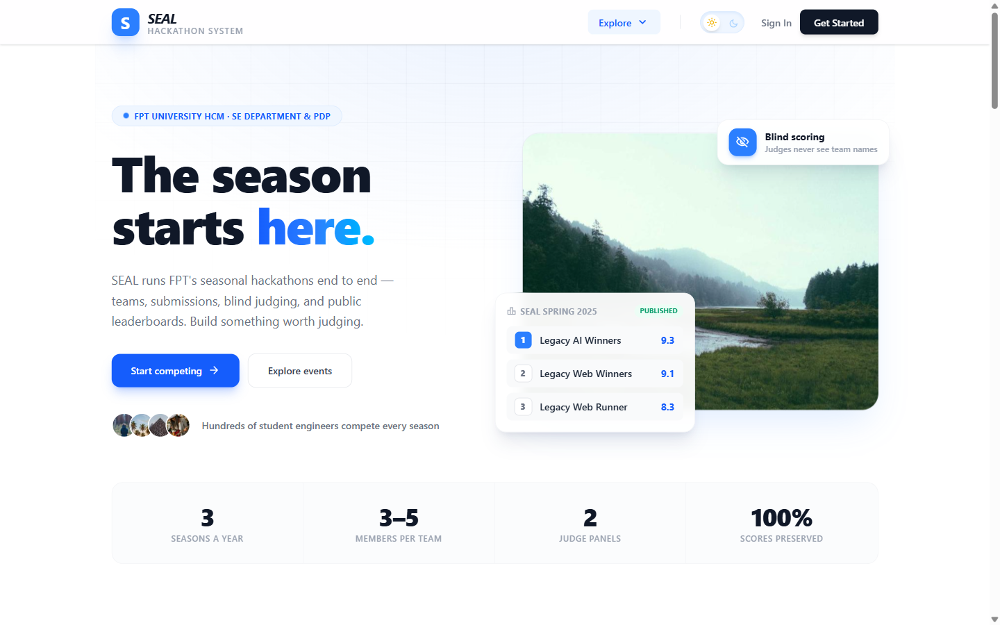
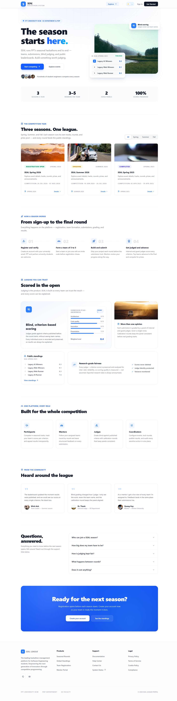
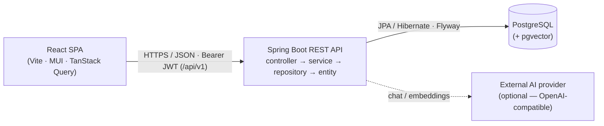
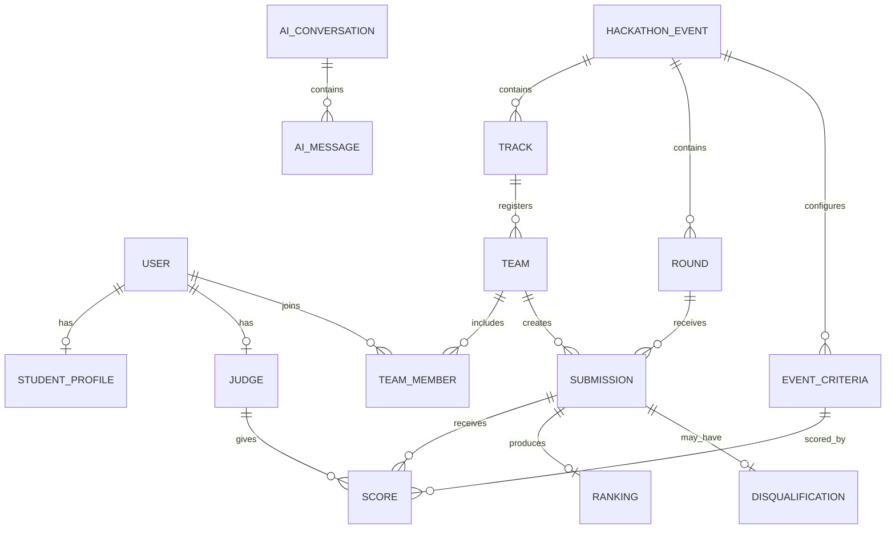
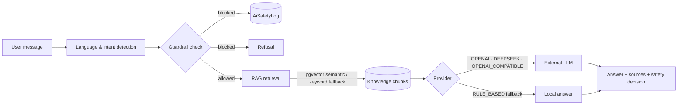

<div align="center">

# 🏆 SEAL

### Software Engineering Hackathon Management System

**Run an academic hackathon end to end — teams, blind judging, live standings, research-grade scoring data, and an AI assistant with academic-integrity guardrails.**

Built by Team T7 for the Software Engineering Department & PDP at **FPT University HCM**.

[](https://openjdk.org/projects/jdk/21/)
[](https://spring.io/projects/spring-boot)
[](https://react.dev/)
[](https://www.typescriptlang.org/)
[](https://www.postgresql.org/)
[](#-feature-tour)

[Quick Start](#-quick-start) · [Feature Tour](#-feature-tour) · [Architecture](#-architecture) · [AI Assistant](#-ai-assistant) · [API Docs](#-api-documentation) · [Research](#-research-inter-rater-reliability)

<br/>



*The public landing page — live standings pulled from the most recent published event.*

</div>

---

## 💡 What is SEAL?

**SEAL** (Software Engineering Agile League) is the annual academic hackathon of FPT University HCM. Each year hosts up to three seasonal events — **Spring**, **Summer**, and **Fall** — where student teams of 3–5 compete in tracks across multiple rounds (Preliminary → Final), graded by panels of internal and guest judges.

This platform replaces the old spreadsheet-driven process with one system covering the **entire competition lifecycle**:

```
Account approval → Team formation → Track registration → Round configuration → Submission
→ Blind judging → Calibration → Ranking → Advancement → Prize publication → Audit & research export
```

Two things make SEAL more than a CRUD app:

- 🔬 **It is a research data platform.** Every individual `judge × criterion × submission` score is preserved and exportable (anonymized) for **inter-rater reliability** analysis — ICC and Krippendorff's α.
- 🤖 **It ships a guarded AI assistant.** A bilingual (VI/EN) chat widget with retrieval-augmented generation over project knowledge — and guardrails that refuse to write hackathon solution code for participants.

### The problems it solves

| Before | With SEAL |
|---|---|
| Teams and tracks managed by hand in spreadsheets | Self-service team formation, invitations, and coordinator approval |
| Judges scoring in separate Excel files, re-entered manually | Blind, criterion-based scoring recorded directly in the system |
| Slow, inconsistent ranking calculation | One-click ranking with tie handling, locked behind grading locks |
| No audit trail for scores and disqualifications | Append-only audit log written in the same transaction |
| Research data impossible to collect cleanly | Raw score preservation + anonymized dataset export |

---

## 📸 Feature Tour

The full landing page, rendered from the running app:

<details>
<summary><b>🖼️ Click to view the full landing page</b></summary>
<br/>



</details>

All six functional modules from the SRS (24 use cases) are implemented end to end:

### 👤 User & Access Management
- Email/password registration with verification, plus **Google/GitHub OAuth2** login.
- JWT access + refresh tokens, optional server-side token blacklist, failed-login lockout.
- Password reset with time-limited codes and password-history reuse prevention.
- Coordinator account approval, admin role management, auto-expiring guest-judge accounts.

### 📅 Event & Configuration Management
- Events by **season + year** with lifecycle control, registration windows, tracks, and rounds.
- Automatic deadline transitions for submission/judging windows.
- Advancement rules (top-N, minimum score, percentage, wildcard), criteria templates with per-event overrides.
- Mentor/judge assignment, prizes, calibration rounds, runtime `SystemConfig` with masked secrets.

### 👥 Team & Participation
- Teams of **3–5 members** — invite by email token or join code, join requests, leadership transfer.
- Track registration with coordinator review; mentor and member progress views.

### 📝 Submission & Grading
- Per-round deliverable links (repo, demo, slides, report, video) with required-link validation and optional GitHub/GitLab metadata extraction.
- **Submission lock** → **blind scoring** (judges never see team names) → **grading lock** → ranking.
- Calibration rounds with benchmark scores and distribution charts; mentor feedback per team.

### 🏅 Results, Audit, Export & Research
- Per-round, per-track ranking with tie handling, advancement confirmation, public standings, prize awards.
- Disqualification with mandatory reason, appeal/overturn, and ranking recalculation.
- Append-only **audit log**, async CSV/XLSX **export jobs**, score-variance dashboard, anonymized research export.

### 🤖 AI, System Config, Health & Reminders
- Floating AI chat for every authenticated user (see [AI Assistant](#-ai-assistant)).
- Admin knowledge management (seeding, chunking, embedding reindex) and guardrail safety logs.
- Coordinator deadline/manual reminders over notification + email channels; admin system-health page.

### By the numbers

| Layer | Scale |
|---|---|
| Domain model | 38 JPA entities · 39 enums · 38 repositories |
| Services | 49 interfaces · 58 implementations |
| REST surface | 33 controllers · 75 request / 113 response DTO records |
| Database | 16 Flyway migrations, `ddl-auto: validate`, optional pgvector |
| Frontend | 24 feature modules across 5 role experiences |
| Background jobs | 6 idempotent schedulers (notifications, deadlines, guest judges, cleanup) |

---

## 🚀 Quick Start

### Prerequisites

**Java 21+** · **Node.js 20+** · **PostgreSQL 15+** · Maven 3.9+ (or the bundled wrapper)

### 1 — Clone & create the database

```bash
git clone https://github.com/Miniks040506/SWP391-SEAL-Software-Engineering-Hackathon-Management-System.git
cd SWP391-SEAL-Software-Engineering-Hackathon-Management-System
createdb seal_hackathon
```

> Flyway runs all 16 migrations (including seed data) on first startup. The pgvector migration runs `CREATE EXTENSION IF NOT EXISTS vector;` — if your DB user can't create extensions, run it once as superuser. The AI assistant degrades gracefully to keyword retrieval without it.

### 2 — Run the backend

```bash
cd "backend/SEAL Hackathon"
# provide DB_USERNAME, DB_PASSWORD, JWT_SECRET, … via environment (see Configuration)

mvnw.cmd spring-boot:run      # Windows
./mvnw spring-boot:run        # Linux / macOS
```

### 3 — Run the frontend

```bash
cd frontend/Seal_Hackathon
cp .env.example .env          # adjust VITE_API_BASE_URL if needed
npm install
npm run dev
```

### You now have

| Resource | URL |
|---|---|
| 🌐 Frontend | `http://localhost:5173` |
| 🔌 API base | `http://localhost:8080/api/v1` |
| 📖 Swagger UI | `http://localhost:8080/swagger-ui.html` |
| ❤️ Health | `http://localhost:8080/actuator/health` |

### Build & test

```bash
cd "backend/SEAL Hackathon" && ./mvnw clean package && ./mvnw test   # backend
cd frontend/Seal_Hackathon && npm run build && npm run lint          # frontend
```

---

## 🏗 Architecture

A decoupled **React SPA + Spring Boot REST API**:



**Backend layering is strict and one-directional** — controllers never touch repositories:

- **Controllers** are thin REST adapters returning `ResponseEntity<T>`; all routes live under `/api/v1` via `ApiPaths.API_V1`.
- **Services** own business logic, transactions, input normalization, and audit logging.
- **Repositories** extend `JpaRepository<Entity, UUID>`; **DTOs** are Java records — entities are never exposed.

### Tech stack

| | Backend | Frontend |
|---|---|---|
| **Core** | Java 21 · Spring Boot 4.0.6 (Web MVC, Security, Data JPA, Mail, Actuator, OAuth2, Scheduling) | React 19 · TypeScript 6 · Vite 8 |
| **Data** | Hibernate · PostgreSQL 15+ · Flyway · pgvector (optional) | TanStack Query 5 · Axios · Zustand 5 |
| **UI** | — | MUI 9 · Tailwind CSS 4 · Recharts 3 · notistack |
| **Auth** | JWT (`jjwt` 0.13) · BCrypt · OAuth2 social login | React Router DOM 7 route gating by role |
| **Forms/validation** | Jakarta Bean Validation | React Hook Form 7 + Zod 4 |
| **Storage & integrations** | Cloudinary (images) · AWS S3 (files) · GitHub/GitLab metadata · SMTP outbox | — |
| **Docs & tooling** | SpringDoc OpenAPI · Maven · Lombok | ESLint · Prettier |

### Background jobs

Six idempotent schedulers reconcile time-driven state:

| Scheduler | Purpose | Default |
|---|---|---|
| `NotificationDispatchScheduler` | Dispatch queued notifications + email outbox | 60 s |
| `RoundDeadlineTransitionScheduler` | Move due rounds into pending-lock/closed | 60 s |
| `RoundDeadlineReminderScheduler` | Reconcile deadline reminders | 300 s |
| `GuestJudgeDeactivationScheduler` | Deactivate expired guest judges | 1 h |
| `TeamIncompleteRegistrationScheduler` | Flag non-admitted incomplete teams | 1 h |
| `UnverifiedAccountAnonymizationScheduler` | Anonymize stale unverified accounts | 1 h |

### Domain model

38 entities across seven groups — the core competition graph:



Key invariants: unique `(season, year)` per event, one submission per `(team, round)`, one score per `(submission, judge, criterion)`, one ranking snapshot per `(submission, round)`. `Submission`, `Score`, `Ranking`, `Disqualification`, and `AuditLog` are **never hard-deleted** after publication.

---

## 🤖 AI Assistant

Every authenticated user gets a floating bilingual (Vietnamese/English) chat widget backed by RAG over project knowledge:



- **Zero-credential default** — `RULE_BASED` mode works with no external API key; any OpenAI-compatible provider can be enabled via `seal.ai.*` properties, with graceful fallback on provider failure.
- **Guardrails** block complete-solution code requests, plagiarism bypass, prompt injection, and private-data extraction. Every BLOCK/ALLOW decision is persisted to `AiSafetyLog` for admin review.
- **RAG sources are shown as cards** in the UI; conversations persist per user and reload from the widget.
- **Admin tooling** — seed default knowledge, create documents with role/module metadata, rebuild embeddings, filter safety logs.

> ⚠️ By design the assistant explains system usage, translates, and guides debugging — **it will not write hackathon solution code for participants**.

---

## 📚 API Documentation

All endpoints are versioned under **`/api/v1`** and documented interactively via **Swagger UI** (`/swagger-ui.html`). The static spec lives at [`docs/openapi/openapi.yaml`](docs/openapi/openapi.yaml).

The REST surface spans **33 controllers**:

| Module | Controllers | Responsibility |
|---|---|---|
| Auth & Users | `Auth`, `User` | Registration, login, OAuth2, verification, reset, profiles, admin user management |
| Events | `Event`, `EventCompetition`, `Track`, `Round` | Event/track/round CRUD, lifecycle, submission & grading locks |
| Configuration | `Criteria`, `System`, `Prize` | Scoring criteria, system config & health, prizes |
| Teams | `Team`, `FormingTeam`, `TeamInvitation`, `TeamJoinRequest`, `CoordinatorTeam` | Team lifecycle, invitations, join requests, registration |
| Judging | `Judge`, `Grading`, `CoordinatorGrading`, `Calibration`, `Mentor` | Assignments, blind scoring, progress, calibration, mentor feedback |
| Submissions | `Submission` | Deliverable submission and locking |
| Results & Research | `Ranking`, `ResultRanking`, `EventAward`, `Disqualification`, `Export`, `ExportJob`, `EventExport` | Ranking, advancement, awards, disqualification, exports |
| Comms & Reminders | `Notification`, `Announcement`, `Reminder` | Inbox, announcements, deadline & manual reminders |
| Audit | `AuditLog` | Audit-log queries |
| AI | `Assistant`, `AiAdmin` | Chat, conversations, knowledge, safety logs |

Paginated lists return `PageResponse<T>`; errors return a consistent `ApiErrorResponse` from a global `@RestControllerAdvice`.

---

## 🔐 Security Model

- **Stateless JWT** (1 h access / 7 d refresh) with `JwtAuthenticationFilter`; login requires a verified + active account — `UNVERIFIED`, `PENDING_APPROVAL`, `LOCKED`, and `SUSPENDED` are rejected.
- **BCrypt** hashing with password-history checks; 6-digit email verification (30 min) and password-reset (15 min) codes; failed-login lockout.
- **Role-based authorization**:

| Role | Scope |
|---|---|
| `STUDENT` | Own profile, team, submissions, own scores, AI assistant |
| `MENTOR` | Assigned teams, mentor feedback |
| `JUDGE` | Assigned grading list, calibration, scoring |
| `COORDINATOR` | Events, rounds, tracks, judges, prizes, results, reminders, exports |
| `ADMIN` | Users, templates, system config, health, audit logs, AI knowledge & safety |

- **Auditing** — every sensitive operation (approvals, locks, score writes, publications, disqualifications, config changes) writes an append-only `AuditLog` entry in the same transaction.
- **AI safety** — provider keys are environment-only; research exports hash judge IDs (SHA-256) and strip team names.

> See [`SECURITY.md`](SECURITY.md) for the full policy and disclosure process.

---

## 🔬 Research (Inter-Rater Reliability)

SEAL preserves raw scoring data to answer: *how consistent are hackathon scores across different judges evaluating the same submission?*

| RQ | Question | Data support |
|---|---|---|
| RQ1 | Overall inter-rater reliability of SEAL scoring? | Raw `Score` rows, `CalibrationScore`, anonymized export |
| RQ2 | Which criteria show highest/lowest agreement? | `ScoringCriteria.is_technical`, variance dashboard |
| RQ3 | Does judge type affect consistency? | `Judge.judge_type` (`INTERNAL` / `GUEST`) |

Anonymized CSV exports (SHA-256 hashed judge IDs, team names stripped) are ready for **ICC** and **Krippendorff's α** analysis.

---

## ⚙️ Configuration

The backend reads configuration from environment variables (sensible dev defaults in `application.yaml`). **Never commit real secrets.**

<details>
<summary><b>Backend environment variables</b></summary>

| Variable | Purpose | Example |
|---|---|---|
| `DB_USERNAME` / `DB_PASSWORD` | PostgreSQL credentials | `postgres` |
| `JWT_SECRET` | HMAC signing key (≥ 32 chars) | `change-me-…` |
| `MAIL_USERNAME` / `MAIL_PASSWORD` | SMTP credentials | app password |
| `FRONTEND_URL` | Allowed CORS origin | `http://localhost:5173` |
| `GITHUB_TOKEN` / `GITLAB_TOKEN` | Repo metadata (optional) | _empty_ |
| `CLOUDINARY_CLOUD_NAME` / `CLOUDINARY_API_KEY` / `CLOUDINARY_API_SECRET` | Image storage | — |
| `AWS_REGION` / `AWS_S3_BUCKET` / `AWS_ACCESS_KEY_ID` / `AWS_SECRET_ACCESS_KEY` | Submission files (optional) | _empty_ |

</details>

<details>
<summary><b>AI assistant variables (<code>seal.ai.*</code>)</b></summary>

The assistant runs out of the box in `RULE_BASED` mode with no credentials. To enable a real model:

| Variable | Purpose | Default |
|---|---|---|
| `SEAL_AI_ENABLED` | Master flag for `/assistant` endpoints | `true` |
| `SEAL_AI_PROVIDER` | `RULE_BASED`, `OPENAI`, `DEEPSEEK`, `OPENAI_COMPATIBLE` | `RULE_BASED` |
| `SEAL_AI_CHAT_BASE_URL` | Chat completions base URL | `https://api.openai.com/v1` |
| `SEAL_AI_CHAT_API_KEY` | Provider API key | _empty_ |
| `SEAL_AI_CHAT_MODEL` | Chat model | `gpt-4o-mini` |
| `SEAL_AI_EMBEDDING_ENABLED` | Semantic retrieval | `true` |
| `SEAL_AI_PGVECTOR_ENABLED` | pgvector search (keyword fallback) | `true` |
| `SEAL_AI_GUARDRAIL_STRICT_FOR_ALL_ROLES` | Guardrails for every role | `true` |
| `SEAL_AI_RESTRICT_TO_PROJECT_SCOPE` | Refuse out-of-scope questions | `true` |

AI credentials live **only** in environment properties — never in `SystemConfig` or frontend code.

</details>

<details>
<summary><b>Frontend variables (<code>frontend/Seal_Hackathon/.env</code>)</b></summary>

```env
VITE_API_BASE_URL=http://localhost:8080/api/v1
VITE_API_NAME=SEAL Hackathon Management System
```

</details>

---

## 📂 Repository Structure

```text
├── backend/SEAL Hackathon/          # Spring Boot service
│   ├── src/main/java/com/t7/seal/
│   │   ├── config/                  # SecurityConfig, ApiPaths, Cloudinary, AI, beans
│   │   ├── controller/              # 33 thin REST controllers
│   │   ├── domain/                  # 39 enums
│   │   ├── entities/                # 38 JPA entities
│   │   ├── repository/              # 38 Spring Data JPA repositories
│   │   ├── request/  response/      # 75 + 113 DTO records by module
│   │   ├── security/  filter/       # JWT / OAuth2 support
│   │   └── service/ (+ impl/)       # 49 interfaces · 58 implementations
│   └── src/main/resources/
│       ├── application*.yaml        # base + dev/prod profiles, seal.ai.*
│       └── db/migration/            # 16 Flyway migrations
│
├── frontend/Seal_Hackathon/         # React + Vite SPA
│   └── src/
│       ├── api/                     # 27 typed API modules + Axios client
│       ├── app/                     # router, providers, theme
│       ├── components/              # common / layout / guards
│       ├── features/                # 24 feature modules (auth, events, teams,
│       │                            #  grading, ranking, assistant, admin, …)
│       └── hooks/ stores/ types/ utils/
│
├── docs/
│   ├── openapi/openapi.yaml         # static API spec
│   ├── screenshots/                 # README screenshots
│   └── demo-test-v19/               # end-to-end demo/test playbooks
├── postman/                         # API test collections
└── SECURITY.md
```

---

## 🤝 Contributing

This is an academic capstone project (SWP391). For team contributors:

- **Branches:** `feature/<name>` · `fix/<name>` · `refactor/<area>` · `docs/<doc>`
- **Commits:** short, imperative, lowercase — `add user entity`, `fix team invitation validation`
- **Before a PR:** code compiles, tests pass, no secrets committed, new endpoints registered in `SecurityConfig`, DTOs validated, sensitive writes audited, schema changes have Flyway migrations.

---

## 👥 Team

Developed by **Team T7** — SWP391, FPT University HCM.

| | | | |
|---|---|---|---|
| [Miniks040506](https://github.com/Miniks040506) | [nguyen2312-dev](https://github.com/nguyen2312-dev) | VoNMThu | DatIT-026 |

---

## 📄 License

No license has been declared yet. Until a license file is added, this code is provided for **academic and educational use** within the scope of the SWP391 course. Contact the team before any external reuse.

---

<div align="center">

Made with ☕ and 🏆 by Team T7 — FPT University HCM

</div>
